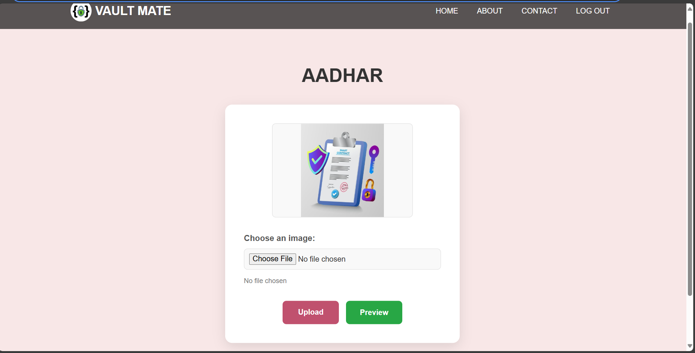

# Vault Mate

## Secure Digital Document Management System



 Vault Mate is a robust and user-friendly web application designed to help individuals securely store, organize, and manage their important digital documents. From personal IDs like Aadhar cards, PAN cards, passports, and driving licenses to academic marksheets and other essential images, Vault Mate provides a centralized, encrypted, and easily accessible digital vault.

Our priority is to ensure your documents are safe, accessible only to you, and well-organized, eliminating the hassle of physical paperwork.

## ✨ Features

* **Secure User Authentication:** Robust sign-up and sign-in processes to protect user accounts.
* **Personalized Digital Vault:** Each user gets a private space to store their documents.
* **Document Upload:** Easily upload various document types (JPG, JPEG, PNG, PDF).
* **Document Categorization:** Clearly defined sections for specific document types, providing an organized overview of your files.
    * Aadhar Card
    * PAN Card
    * Passport
    * Driving License
    * 10th Marksheet
    * 12th Marksheet
    * ABC ID
    * Other Documents/Images
* **Document Preview:** View uploaded documents directly within the application.
* **Contact Page:** Provides ways for users to get in touch.
* **About Page:** Explains the mission, benefits, and how Vault Mate works.
* **Responsive Design:** Optimized for seamless experience across various devices (desktop, tablet, mobile).
* **Secure Logout:** Proper session termination by clearing authentication tokens.

## 🚀 Technologies Used

* **Backend:**
    * **Node.js:** JavaScript runtime environment.
    * **Express.js:** Web application framework for Node.js.
    * **MongoDB (Mongoose):** NoSQL database for storing user and image data.
    * **Multer:** Node.js middleware for handling `multipart/form-data`, primarily for file uploads.
    * **jsonwebtoken (JWT):** For generating and verifying authentication tokens.
    * **dotenv:** For managing environment variables.
    * **cookie-parser:** Middleware to parse cookies.
* **Frontend:**
    * **EJS (Embedded JavaScript):** Templating engine for dynamic HTML generation.
    * **HTML5:** Structure of the web pages.
    * **CSS3:** Styling and animations.
    * **JavaScript:** Client-side interactivity and form handling.
    * **Font Awesome:** For scalable vector icons.
    * **jQuery:** (Used in `signup.ejs`, though modern JS often replaces it).

## 🛠️ Setup and Installation

Follow these steps to get Vault Mate up and running on your local machine.

### Prerequisites

* Node.js (LTS version recommended)
* MongoDB (running locally or a cloud instance like MongoDB Atlas)
* Git

### Steps

1.  **Clone the repository:**
    ```bash
    git clone [https://github.com/YOUR_GITHUB_USERNAME/YOUR_REPOSITORY_NAME.git](https://github.com/YOUR_GITHUB_USERNAME/YOUR_REPOSITORY_NAME.git)
    cd YOUR_REPOSITORY_NAME
    ```
    (Replace `YOUR_GITHUB_USERNAME` and `YOUR_REPOSITORY_NAME` with your actual GitHub details.)

2.  **Install dependencies:**
    ```bash
    npm install
    ```

3.  **Set up environment variables:**
    Create a `.env` file in the root of your project and add the following:
    ```
    PORT=3000
    MONGODB_URI=YOUR_MONGODB_CONNECTION_STRING
    JWT_SECRET=YOUR_VERY_STRONG_JWT_SECRET
    ```
    * Replace `YOUR_MONGODB_CONNECTION_STRING` with your MongoDB connection URI (e.g., `mongodb://localhost:27017/vaultmate` or your Atlas URI).
    * Replace `YOUR_VERY_STRONG_JWT_SECRET` with a long, random string.

4.  **Run the application:**
    ```bash
    node app.js
    ```
    The server will start, typically on `http://localhost:3000` (or the port specified in your `.env` file).

## 📸 Screenshots

Here are some screenshots showcasing the Vault Mate application's interface:

---

### 1. Registration Form

A clean and intuitive form for new users to sign up for Vault Mate, featuring a consistent visual style.


---

### 2. Main Document Categories

The central page displaying various document categories, allowing users to navigate to their stored files.


---

### 3. Document Upload Page

The interface for securely uploading new documents to your personalized vault, maintaining the application's aesthetic.


---

## 🤝 Contributing

We welcome contributions! If you have suggestions for improvements or find any issues, please feel free to:

1.  Fork the repository.
2.  Create a new branch (`git checkout -b feature/your-feature-name`).
3.  Make your changes.
4.  Commit your changes (`git commit -m 'Add new feature'`).
5.  Push to the branch (`git push origin feature/your-feature-name`).
6.  Open a Pull Request.

## 📄 License

This project is licensed under the MIT License - see the `LICENSE` file for details (if you have one, otherwise remove this section or add a license).

---
